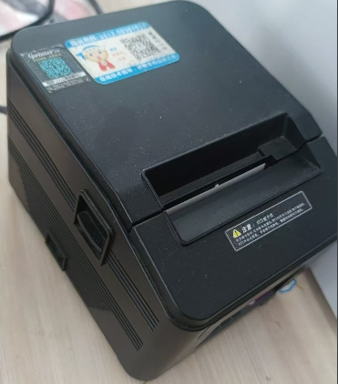
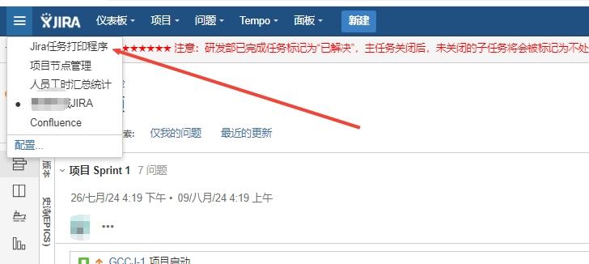
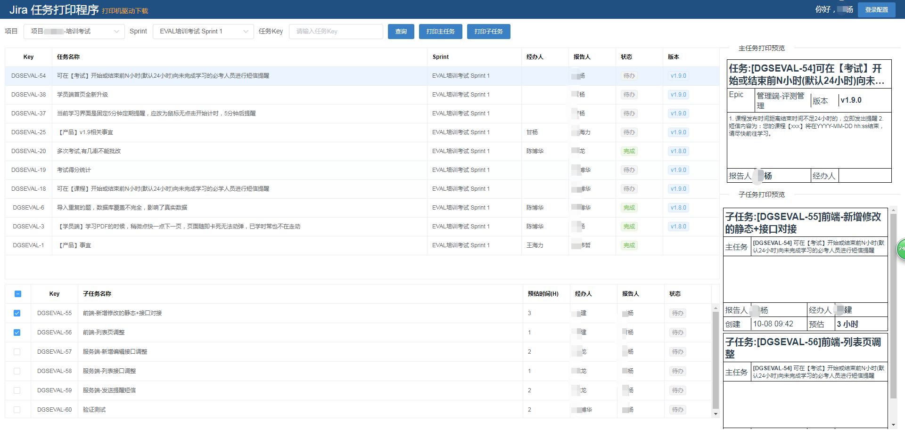

<h1 align='center'>集成Jira的敏捷开发Scrum看板任务打印助手</h1>
<h2 align='center'>Scrum Board Task Printing Assistant, integrated with Jira</h2>
这是一个VUE2项目,通过调用Jira rest api获取数据,完成打印功能.

## &#x1F4E3; &#x1F4E3; Updates
* [后来] 太多次小更新了,就不赘述了。
* [2021.09.21] 🔥 完成第一个版本的发布。

## Online Demo(在线体验)
在线体验搭建中....

## Preview(预览)
#### 专用打印机及Scrum看板效果
<div style="margin: 0 auto;">
  
  
</div>

#### 任务打印助手
<div style="width: 25%; margin: 0 auto;">
  
</div>
<div style="width: 25%; margin: 0 auto;">
  
</div>
<div style="width: 25%; margin: 0 auto;">
  
</div>

### Nginx Conf
通过nginx配置反向代理至jira api地址, 例如http://192.168.0.45:9090/
```cf
location /jira-printer {
    alias /usr/local/openresty/nginx/html/jira-printer;
    try_files $uri $uri/ /jira-printer/index.html;
    index  index.html;
}

location /jira-api/ {
  add_header Access-Control-Allow-Origin  *;
  add_header Access-Control-Allow-Credentials 'true';
  add_header Access-Control-Allow-Methods 'GET, POST, OPTIONS';
  add_header Access-Control-Allow-Headers 'DNT,X-Mx-ReqToken,Keep-Alive,User-Agent,X-Requested-With,If-Modified-Since,Cache-Control,Content-Type,Authorization,x-xsrf-token,Set-Cookie';
  if ($request_method = 'OPTIONS') {
      return 204;
  }
   proxy_set_header    Host $host;
   proxy_set_header    X-Real-IP $remote_addr;
   proxy_set_header    X-Forwarded-For   $proxy_add_x_forwarded_for;
   proxy_pass http://192.168.0.45:9090/;
}
```

## Tech Support(技术支持)
<div style="width: 25%; margin: 0 auto;">
  
</div>
